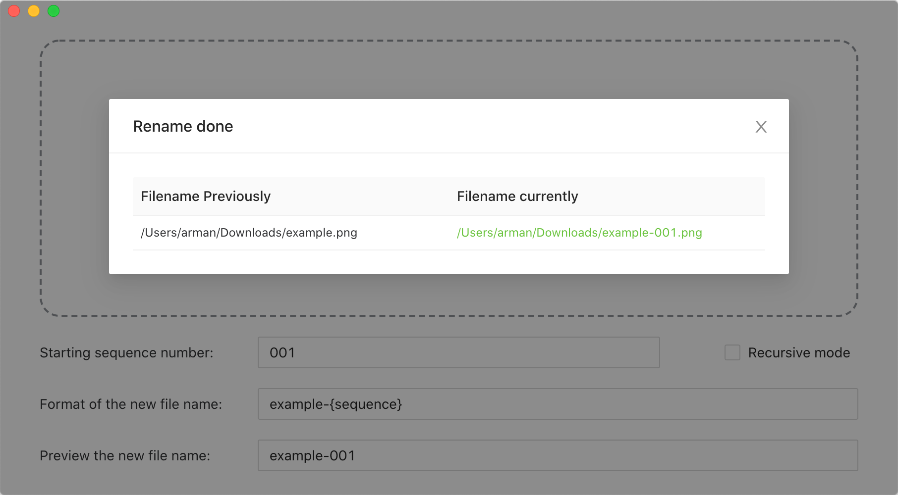

# Image Renamer

[English](./README.md) | 简体中文

下载链接: [MacOS](https://github.com/Arman19941113/image-renamer/releases/download/v0.0.2/ImageRenamer-0.0.2.dmg) [Windows](https://github.com/Arman19941113/image-renamer/releases/download/v0.0.2/ImageRenamer.Setup.0.0.2.exe)

### 跨平台图片文件批量重命名工具

## 使用

### 1. 使用需要读取 exif 信息的变量：`{YYYY}`, `{MM}`, `{DD}`, `{hh}`, `{mm}`, `{ss}`, `{make}`, `{model}`, `{lens}`

#### 最好是有完整 exif 信息的 jpg 文件

#### 如果相关 exif 信息缺失，默认会使用相关变量字符替代。

#### 如果文件没有 exif 信息一般不会修改原文件名。

### 2. 只使用 `{sequence}` 变量

#### 将会根据序号自动编号重命名所有文件，除非文件名已存在。所以要尽量给到足够大的序号，比如有几百个文件要命名，`{sequence}` 最好是从 `001` 开始。

