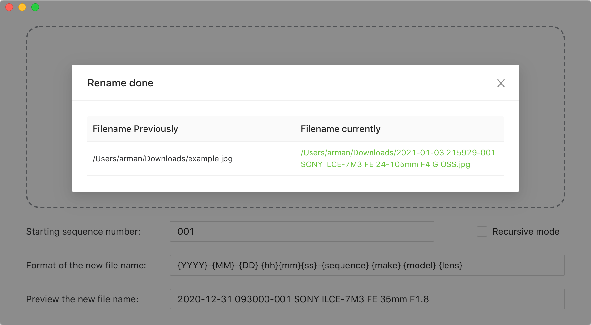
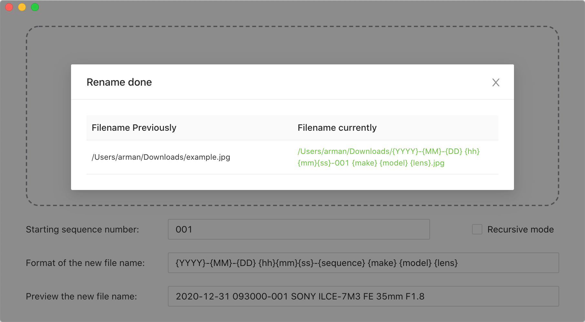
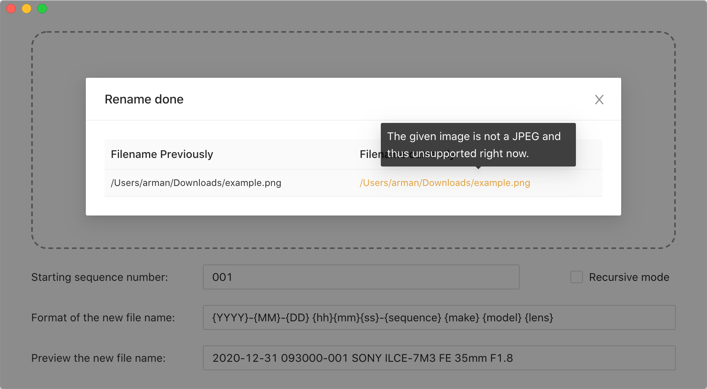
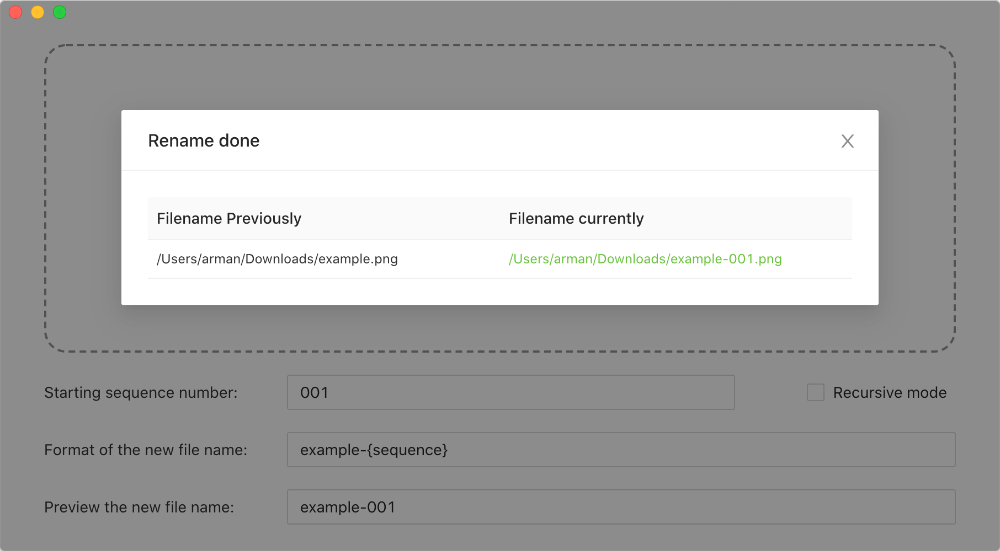

# Image Renamer

English | [简体中文](./README-zh.md)

Download APP: [MacOS](https://github.com/Arman19941113/image-renamer/releases/download/v0.0.3/ImageRenamer-0.0.3.dmg) [Windows](https://github.com/Arman19941113/image-renamer/releases/download/v0.0.3/ImageRenamer.Setup.0.0.3.exe)

### A cross-platform jpg files rename tool.

## Usage

### 1. Case you used the exif variables: `{YYYY}`, `{MM}`, `{DD}`, `{hh}`, `{mm}`, `{ss}`, `{make}`, `{model}`, `{lens}`

#### The best case is renaming jpg file with exif data.

#### If the jpg file is lack of some variable like `{lens}`, the variable will be replaced with string of `{lens}`.

#### If your file does't exist exif data, this app won't modify your filename.

### 2. Case you just use the `{sequence}` variable

#### This app will rename all files unless the filename is conflict. So you'd better make sure you the `{seqnence}` is big enough to guarantee the uniqueness of the filename.

